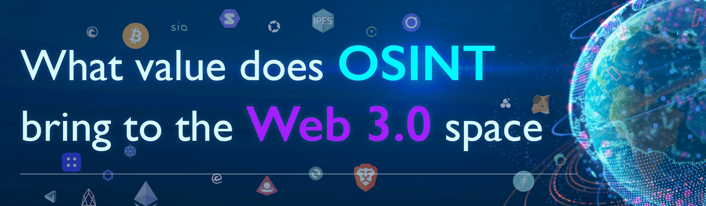

<h1 align="center">What value does OSINT bring to <br> the Web 3.0 space</h1>


## Resources

### The best blockchain video to understand the basics

https://www.youtube.com/watch?v=_160oMzblY8


### ENS Resources

-   [app.ens.domains/](https://app.ens.domains/)
-   [ens.me/domains/expired](https://ens.me/domains/expired)
-   [discuss.ens.domains/t/ens-dao-delegate-applications/](https://discuss.ens.domains/t/ens-dao-delegate-applications/)
-   [etherscan.io/enslookup](https://etherscan.io/enslookup)
-   [metadata.ens.domains/docs](https://metadata.ens.domains/docs)


### Social Media on P2P/BlockChain

-   LBRY -- https://lbry.com

-   KARMA - Mobile only in PLay and APP store

-   Dtube - signup.d.tube

-   Steemit -- steemit.com/\

-   Uptrennd-app.uptrends.com/

-   Indorse -- indorse.io/

-   Minds -- minds.com/login

-   Peepeth - peepeth.com/welcome

-   Twetch - twetch.com/welcome

-   Hive Blog - hive.blog/

-   Trybe - trybe.ly/

-   Sapien.network - www.sapien.network/

-   Aether - getaether.net/

-   Mastodon - mastodon.social/about

### Decentralized Domain name services

-   UNS Unstoppable name registration: unstoppabledomains.com

-   DAS Domain name registration ：da.systems/

-   solana Chain domain name registration ：naming.bonfida.org/#/

-   Flow Domain name registration ：mynft.io/flowns

-   Terra Chain domain name registration ：tns.money/

-   CELO Domain name registration ：app.nom.space/#/search

-   Tezos Chain domain name registration ：app.nom.space/#/

-   FIO Protocol Domain name registration ：fioprotocol.io/

-   Avalanche Domain name registration ：avvy.domains/legacy/

### The GraphQL playground for information/graphql

-   As an example template to search: '[example.com/v1/graphql](https://example.com/v1/graphql)'

-   Playgrounds to test the Schema for a GraphQL link:

-   api.ideavate.co/v1/graphql

-   apis.guru/graphql-voyager

### DAO

-   Curve.fi

-   Dune.xyz

### Crypto ICONS

-   cryptoicons.co/

-   cryptologos.net/

-   cryptologos.cc/

### Decentralized Webs /Services

-   esteroids.xyz

-   filecoin.io

### Web3 APIs

-   api3.org/apis

-   thegraph.com

-   mirror.xyz

### NFT tracking for projects:

-   Dune.xyz

-   nonfungible.com

### HNS - HandShake DNS

-   www.hdns.io/#

-   hda-hns.herokuapp.com

### Crypto Currencies Wallet Investigations tool

-   ethtective.com

-   www.breadcrumbs.app

-   kycp.org

-   Web3isgoinggreat.com

-   investigations.notion.site

### IPFS

-   awesome.ipfs.io

-  ipfsbrowser.com

-   awesomeopensource.com/projects/ipfs

### Blockchains Tools

-   General

    -  chainlist.org

    -   Blockchair.com

    -   Hashxp.org

    -   Infura.io

-   Cardano:

    -   blockchair.com/cardano

    -   explorer.cardano.org/en

    -   Cardanoscan.io

-   Monero:

    -   Xmr.tokenview.com

    -   Xmrchain.net

-   Ethereum

    -   Etherscan.io

    -   explorer.rebellious.io

-   Binance

    -   Bscscan.com

-   Polygon

    -   polygonscan.com/

-   Bitcoin

    -   Bitcoinwhoswho.com

    -   Btc.com

### API Calls

- Decentralands user profile API

  ```
  peer-lb.decentraland.org/lambdas/profiles?id=Eth address
  ```

  

- OPEN SEA Asset API call

  ```
  opensea.io/assets/\*\*ETH_Wallet\*\*/\*\*token_id\*\*
  ```

  

- Treasureland.market Marketplace

  ```
  api.treasureland.market/v1/\*\*ETH_Wallet\*\*/\*\*Token_id\*\*
  ```

-   Cryptoland

    -   https://api.cryptoland.is/v1/website

-   Google storage API

    -   https://storage.googleapis.com/cryptoland

    -   https://storage.googleapis.com/cryptoland/light/9004.jpg

##  


## Future Research

### Web3, Blockchain, and CryptoCurrencies projects

Check the different coin projects, breakdown of other speciality projects and global view of the space.

-   Coinmarketcap.com

-   Coingecko.com

-   wordproof.com

### Metaverse and VR/AR

-   Existing VR and new companies

-   What can we learn from that landscape?

### NFT Gaming

-   User enumeration

-   Information collection

### Shadow projects

-   Tornado Cash

    -   tornado.cash

-   CakeWallet:

    -   Cakewallet.com

-   Cryptoland

    -   api.cryptoland.is/v1/website

### Web3 wallets

-   MetaMask:

    -   github.com/MetaMask
    -   metamask.io
    
    
---

​    


## Future Reading - More details in story form:

-   [www.vice.com/en/article/epxakz/crypto-co-founder-revealed-to-be-infamous-fraudster-investors-shaken](http://www.vice.com/en/article/epxakz/crypto-co-founder-revealed-to-be-infamous-fraudster-investors-shaken)
